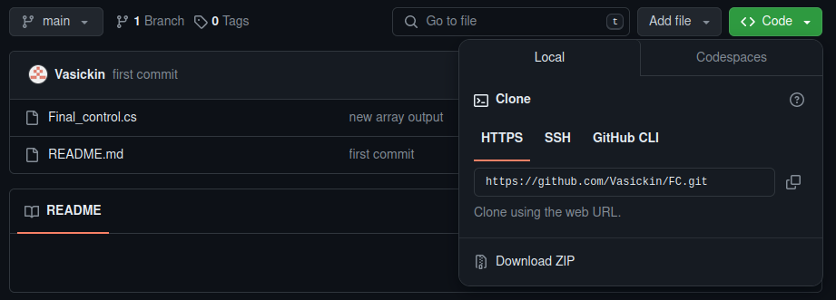
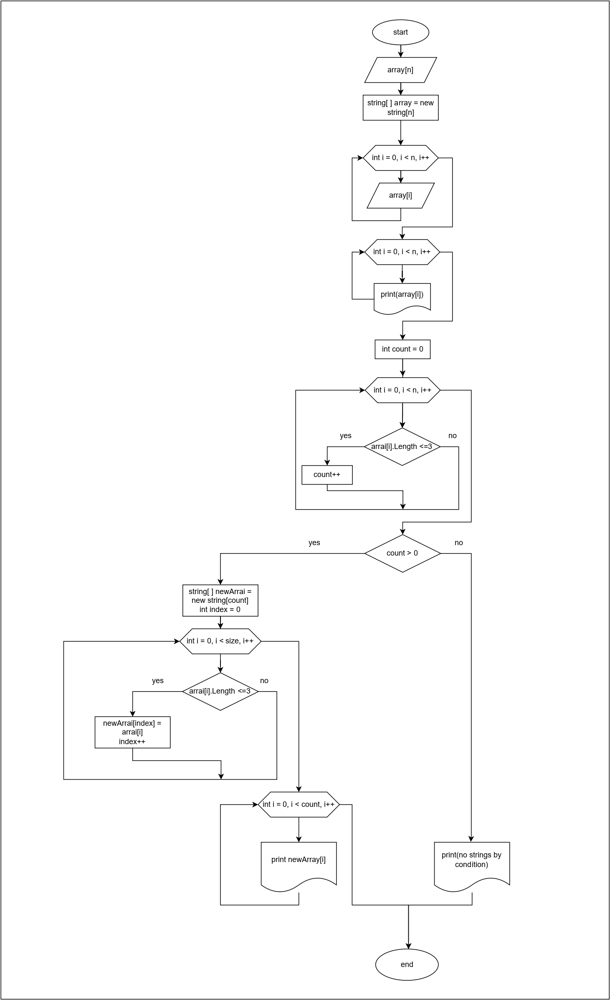

## Эта программа которая из имеющегося массива строк формирует новый массив из строк, длина которых меньше, либо равна 3 символам.

### Шаги
1. Создайте на локальном компютере папку, название латинскими буквами, желательно без пробелов.

2. Откройте созданную папку в Visual Studio Code.

3. Запустите встроенный терминал для этой папки.

4. Перейдите на главную страницу репозитория GitHubub [по ссылке ](https://github.com/Vasickin/FC.git). склонируйте репозиторий с кодом на ваш локальный компьютер. В запущенном терминале используйте команду git clone <URL репозитория> чтобы склонировать репозиторий с кодом на ваш локальный компьютер



5. После определения структуры проекта, определения зависимостей, конфигурайии среды разработки можно запустить программу написав в терминале команду:

```
dotnet run
```
6. После запуска программы следуйте подсказкам в терминале.

## Ниже прилогается блок схема 

